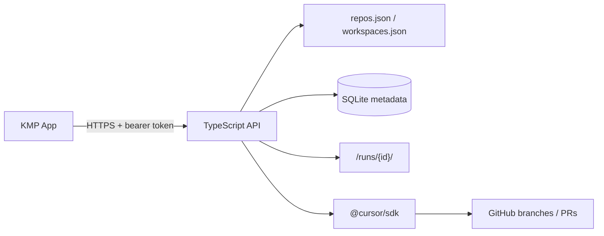

# Remote Cursor Agent Controller — API Spec

TypeScript service on a GCP VM that accepts mobile requests, materializes server-defined workspaces, runs Cursor SDK agents, streams progress, and opens Git branches/PRs. Prompts are not stored in the app database; Cursor conversation state lives on disk only.

**Client spec:** [Kotlin Multiplatform App Spec](./remote-cursor-agent-kmp-app-spec.md)

## Architecture



| Layer | Responsibility |
| --- | --- |
| Mobile | Select workspace, send prompt, stream events, read summary |
| API | Auth, allowlists, worktrees, agent lifecycle, git/PR side effects |
| Disk | Worktrees, Cursor state, append-only event log, result artifact |
| DB | Run metadata only — no prompts or transcripts |

## Stack

| Area | Choice |
| --- | --- |
| Runtime | Node.js 24+ LTS, TypeScript strict |
| HTTP | [Hono](https://hono.dev) — small surface, native SSE |
| Validation | Zod (config + request bodies) |
| Agent | `@cursor/sdk` (CLI fallback only if SDK gap) |
| Metadata | SQLite via `better-sqlite3` |
| Streaming | Server-Sent Events |
| Workspaces | Per-run git worktrees (one per repo) |
| Auth (MVP) | Single shared bearer token → OIDC/Stytch later |

## Domain

```ts
type Repo = {
  id: string;
  name: string;
  url: string;
  defaultBranch: string;
  enabled: boolean;
};

type WorkspaceRepo = {
  repoId: string;
  role: string;
  path: string; // relative dir inside run workspace
};

type Workspace = {
  id: string;
  name: string;
  repos: WorkspaceRepo[];
  defaultPromptContext?: string;
};

type RunMode = "plan_only" | "apply";
type RunStatus = "queued" | "running" | "completed" | "failed" | "cancelled";
```

- **Repo** — one Git remote
- **Workspace** — curated bundle of repos (mobile picks `workspaceId` only)
- **Run** — one agent task against a workspace
- **Conversation** — SDK-managed state under `cursor-state/`; not in SQLite

## Server config

Mobile clients never send repo URLs or filesystem paths.

**`config/repos.json`**

```json
[
  {
    "id": "openclaw-api",
    "name": "OpenClaw API",
    "url": "git@github.com:your-org/openclaw-api.git",
    "defaultBranch": "main",
    "enabled": true
  },
  {
    "id": "openclaw-client",
    "name": "OpenClaw Client",
    "url": "git@github.com:your-org/openclaw-client.git",
    "defaultBranch": "main",
    "enabled": true
  }
]
```

**`config/workspaces.json`**

```json
[
  {
    "id": "openclaw-fullstack",
    "name": "OpenClaw Full Stack",
    "repos": [
      { "repoId": "openclaw-api", "role": "api", "path": "api" },
      { "repoId": "openclaw-client", "role": "client", "path": "client" }
    ],
    "defaultPromptContext": "Use api/ for the TS server and client/ for the KMP app."
  }
]
```

## HTTP API

All routes under `/v1`. Auth: `Authorization: Bearer <token>`.

### Types

```ts
type CreateRunRequest = {
  workspaceId: string;
  mode: RunMode;
  prompt: string;
  baseRef?: string; // optional override per repo default
};

type RunSummary = {
  id: string;
  workspaceId: string;
  status: RunStatus;
  mode: RunMode;
  repos: Array<{
    repoId: string;
    role: string;
    path: string;
    branch?: string;
    prUrl?: string;
  }>;
  resultPath?: string; // server-relative handle, not raw file dump
  createdAt: string;
  updatedAt: string;
};

type SseEvent =
  | { type: "status"; status: RunStatus }
  | { type: "log"; message: string }
  | { type: "tool"; name: string; summary?: string }
  | { type: "result"; ok: boolean }
  | { type: "error"; message: string };
```

### Endpoints

| Method | Path | Purpose |
| --- | --- | --- |
| `GET` | `/workspaces` | List server-defined workspaces |
| `POST` | `/runs` | Create run (`CreateRunRequest`) → `{ id }` |
| `GET` | `/runs/{id}` | `RunSummary` |
| `GET` | `/runs/{id}/events` | SSE stream of `SseEvent` |
| `POST` | `/runs/{id}/continue` | `{ prompt: string }` — uses on-disk Cursor state |
| `POST` | `/runs/{id}/cancel` | Cancel SDK + child processes |

## On-disk layout

```
/srv/remote-agent/
  config/
    repos.json
    workspaces.json
  data/
    runs.sqlite
  runs/
    run_123/
      workspace/          # git worktrees
        api/
        client/
      cursor-state/       # SDK conversation (sensitive)
      events.jsonl        # append-only audit
      result.json
      branches.json       # branch + PR mapping
```

## SQLite (metadata only)

**`runs`**

| Column | Type | Notes |
| --- | --- | --- |
| `id` | text PK | App run id |
| `workspace_id` | text | |
| `status` | text | `RunStatus` |
| `mode` | text | `RunMode` |
| `run_path` | text | Absolute path to run folder |
| `cursor_state_path` | text | Server-only |
| `created_at` | text | ISO-8601 |
| `updated_at` | text | ISO-8601 |

**`run_repos`**

| Column | Type |
| --- | --- |
| `run_id` | text FK |
| `repo_id` | text |
| `role` | text |
| `path` | text |
| `base_ref` | text |
| `branch` | text nullable |
| `pr_url` | text nullable |

**Never persist:** prompt text, full transcripts, secrets, shell history.

## Run lifecycle

1. `POST /runs` — validate token, resolve workspace allowlist, insert DB row (`queued`).
2. Create `runs/{id}/`, add worktrees under `workspace/`.
3. Start `@cursor/sdk` at workspace root; set status `running`.
4. Append SDK output to `events.jsonl`; fan out via SSE.
5. On completion — write `result.json`, update `run_repos` for changed repos only.
6. Push branches and open PRs for repos with changes.
7. Set terminal status (`completed` | `failed` | `cancelled`).

`POST /continue` resumes from `cursor-state/` without re-cloning. `POST /cancel` aborts the active SDK session and marks `cancelled`.

## Security & constraints

- No arbitrary shell or file endpoints.
- Repo/workspace IDs must exist in server config.
- Per-run timeout (`RUN_TIMEOUT_MS`) and explicit cancellation; cancel blocks git push/PR.
- Max concurrent runs (`MAX_CONCURRENT_RUNS`, default 3).
- One worktree per repo per run.
- Mobile receives summaries and SSE — not full repo trees or Cursor state blobs.
- Only repos with detected changes are pushed / PR-created.
- `events.jsonl` is append-only for audit; treat `cursor-state/` as sensitive.
- Secrets (`REMOTE_AGENT_TOKEN`, `CURSOR_API_KEY`, `GITHUB_TOKEN`) are scrubbed from `process.env` at startup; git/gh receive tokens via isolated env only.
- Optional `REMOTE_AGENT_APPLY_TOKEN` restricts `mode: "apply"` runs to a separate bearer token.
- Client `baseRef` must match `^[a-zA-Z0-9/._-]+$`.
- SSE error events use generic messages; details are logged server-side only.
- `SSE_MAX_WAIT_MS` caps how long event streams wait for terminal status (default: run timeout + 5 min).
- `resultPath` in summaries is an opaque handle (`runs/{id}/result`), not an absolute path.

## Out of scope (MVP)

Postgres/Redis, multi-user auth, GitHub repo discovery, cloud runtime, object-storage artifacts, billing.

## Windows dev notes

Run the API locally with Node 24+ (nvm-windows or official installer). Use Git for Windows for worktree support. Point `REMOTE_AGENT_DATA` at the project root (contains `config/`, `data/`, `runs/`). SQLite and SSE work the same on Windows; deploy target remains Linux on GCP.
