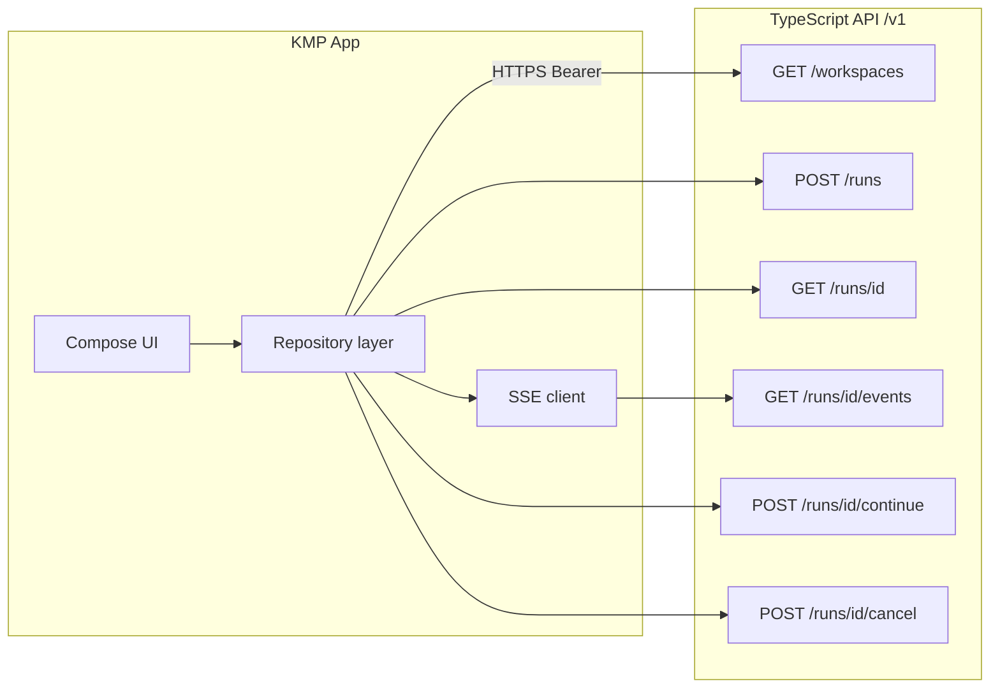
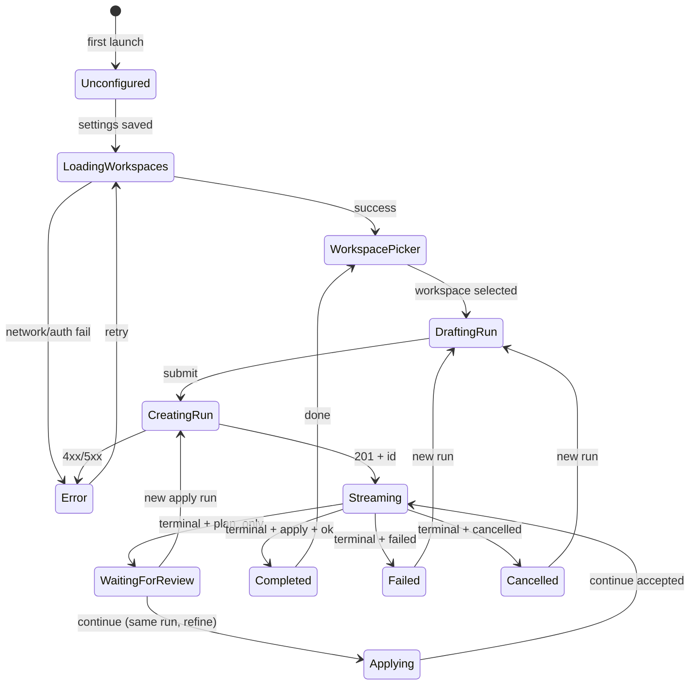

# Remote Cursor Agent Controller — Kotlin Multiplatform App Spec

Mobile client for the [Remote Cursor Agent API](./remote-cursor-agent-api-spec.md). Lets the user pick a server-defined workspace, submit agent runs, stream progress, continue or cancel work, and open PR results. The app never discovers repos directly and never receives VM filesystem paths.

## App boundary



| Route | Purpose |
| --- | --- |
| `GET /v1/workspaces` | List server-defined workspaces |
| `POST /v1/runs` | Create run → `{ id }` |
| `GET /v1/runs/{id}` | Poll `RunSummary` (reconnect, background refresh) |
| `GET /v1/runs/{id}/events` | SSE stream of `SseEvent` |
| `POST /v1/runs/{id}/continue` | Follow-up prompt; server resumes on-disk Cursor state |
| `POST /v1/runs/{id}/cancel` | Abort active SDK session |

Server contract details: [remote-cursor-agent-api-spec.md](./remote-cursor-agent-api-spec.md).

---

## MVP stack

| Area | Choice | Notes |
| --- | --- | --- |
| Shared module | Kotlin Multiplatform | DTOs, repository, SSE parser, state machine |
| Android UI | Jetpack Compose | Android first; Compose Multiplatform later |
| Networking | Ktor Client | JSON REST + SSE (`HttpStatement` / custom reader) |
| Serialization | kotlinx.serialization | `@Serializable` models; sealed `SseEvent` |
| DI | Koin or manual | Keep MVP thin |
| Local cache | Optional | Recent run ids + terminal status only; server is source of truth |
| Auth (MVP) | Static bearer token | Android: EncryptedSharedPreferences / DataStore + optional BiometricPrompt gate |
| iOS (later) | Keychain | Same shared repository; platform secure storage |

---

## Primary screens

| Screen | Responsibility |
| --- | --- |
| **Onboarding / Settings** | API base URL, bearer token, optional apply token, connection test |
| **Workspace list** | Cards from `GET /workspaces`; show repo roles, not URLs |
| **New run** | Workspace (pre-selected or picker), mode (`plan_only` \| `apply`), prompt, optional `baseRef` |
| **Run detail** | Status badge, live timeline (SSE), cancel, continue, results |
| **Results** | Repos with branch + PR links; open GitHub externally |

### Navigation (MVP)

```
Settings ──► Workspace list ──► New run ──► Run detail ──► Results (section or sheet)
                  ▲                              │
                  └──────── recent runs ─────────┘
```

---

## User flows

### Happy path — plan then apply

1. Launch → validate settings → `GET /workspaces`.
2. Pick workspace → enter prompt → choose `plan_only` → `POST /runs`.
3. Navigate to run detail → subscribe SSE → render timeline.
4. On `completed` + `result.ok`, show plan summary from timeline / poll `GET /runs/{id}`.
5. User taps **Apply plan** → prompt for apply token if configured server-side → `POST /runs` with `mode: "apply"` and implementation prompt.

> **Mode note:** `POST /continue` does not accept a `mode` field. A run keeps the mode set at creation. `continue` on a `plan_only` run refines the plan but does **not** open PRs. PRs are created only when the run was created with `mode: "apply"`. Same-run plan→apply without a new run requires a future API extension (deferred).

### Happy path — apply directly

1. Choose workspace → `mode: "apply"` → submit (apply token required when server sets `REMOTE_AGENT_APPLY_TOKEN`).
2. Stream events → on success, show repos with `prUrl` from `RunSummary`.

### Cancel

1. User taps **Cancel** while status is `queued` or `running`.
2. `POST /runs/{id}/cancel` → expect SSE `status: cancelled` and `result: { ok: false }`.

### SSE reconnect

1. On disconnect (background, network flap, stream timeout): `GET /runs/{id}` first.
2. If terminal (`completed` \| `failed` \| `cancelled`): update UI from summary; do not resubscribe.
3. If still active: resubscribe to `/events` with exponential backoff (see edge cases).

---

## API models (shared KMP)

Aligned with the [API spec](./remote-cursor-agent-api-spec.md) types section.

```kotlin
@Serializable
data class WorkspacesResponse(
    val workspaces: List<WorkspaceDto>,
)

@Serializable
data class WorkspaceDto(
    val id: String,
    val name: String,
    val repos: List<WorkspaceRepoDto>,
    val defaultPromptContext: String? = null,
)

@Serializable
data class WorkspaceRepoDto(
    val repoId: String,
    val role: String,
    val path: String, // relative label only — not a server filesystem path exposed to user
)

@Serializable
enum class RunMode {
    @SerialName("plan_only") PLAN_ONLY,
    @SerialName("apply") APPLY,
}

@Serializable
enum class RunStatus {
    @SerialName("queued") QUEUED,
    @SerialName("running") RUNNING,
    @SerialName("completed") COMPLETED,
    @SerialName("failed") FAILED,
    @SerialName("cancelled") CANCELLED,
}

@Serializable
data class CreateRunRequest(
    val workspaceId: String,
    val mode: RunMode,
    val prompt: String,
    val baseRef: String? = null,
)

@Serializable
data class CreateRunResponse(val id: String)

@Serializable
data class ContinueRunRequest(val prompt: String)

@Serializable
data class RunRepoDto(
    val repoId: String,
    val role: String,
    val path: String,
    val branch: String? = null,
    val prUrl: String? = null,
)

@Serializable
data class RunSummaryDto(
    val id: String,
    val workspaceId: String,
    val status: RunStatus,
    val mode: RunMode,
    val repos: List<RunRepoDto> = emptyList(),
    val resultPath: String? = null, // opaque handle — do not fetch directly in MVP
    val createdAt: String,
    val updatedAt: String,
)

@Serializable
data class ApiErrorResponse(
    val error: String,
    val details: JsonObject? = null,
)
```

### SSE event model

Server sends `event: <type>` with JSON body. Map to a sealed class:

```kotlin
@Serializable
sealed class SseEvent {
    @Serializable
    @SerialName("status")
    data class Status(val type: String = "status", val status: RunStatus) : SseEvent()

    @Serializable
    @SerialName("log")
    data class Log(val type: String = "log", val message: String) : SseEvent()

    @Serializable
    @SerialName("tool")
    data class Tool(
        val type: String = "tool",
        val name: String,
        val summary: String? = null,
    ) : SseEvent()

    @Serializable
    @SerialName("result")
    data class Result(val type: String = "result", val ok: Boolean) : SseEvent()

    @Serializable
    @SerialName("error")
    data class Error(val type: String = "error", val message: String) : SseEvent()
}
```

| Event | UI treatment |
| --- | --- |
| `status` | Header badge, enable/disable Cancel and Continue |
| `log` | Assistant narrative bubble in timeline |
| `tool` | Compact monospace row; collapsible detail |
| `error` | Error banner; distinguish fatal vs recoverable (see edge cases) |
| `result` | Close active stream UI; refresh summary |

---

## UI state machine



| State | Cancel | Continue | Apply (new run) |
| --- | --- | --- | --- |
| `Streaming` (queued/running) | Yes | No | No |
| `WaitingForReview` (plan completed) | No | Yes (refine plan) | Yes (`mode: apply`) |
| `Failed` / `Cancelled` | No | No | Retry via new run |
| `Completed` (apply) | No | Optional follow-up | N/A |

---

## Security

### Threat model (MVP)

| Asset | Risk | Mitigation |
| --- | --- | --- |
| Bearer token | Device theft, backup leak | Encrypted storage; exclude from cloud backup (`android:allowBackup=false` for prefs); optional biometric unlock |
| Apply token | Privileged runs | Separate field; used only for `mode: apply` requests; never logged |
| Prompt text | Sensitive business logic | In-memory only unless user enables drafts; clear on logout |
| SSE / logs | Token in logcat | Never log `Authorization` header or full prompts in release builds |
| MITM | Token interception | HTTPS only; validate URL scheme (`https://`); certificate pinning deferred but document hook |
| Clipboard | Token paste leak | Clear-sensitive-fields on background; warn on export |

### Client rules

- Reject non-HTTPS base URLs in production builds (debug may allow `http://10.0.2.2` for emulator).
- Store tokens with `EncryptedSharedPreferences` or Encrypted DataStore.
- Use `Authorization: Bearer <token>` on every request; rotate by updating settings only.
- When server returns `403` on apply runs, show “Apply token required” — do not retry with the plan token.
- Treat all SSE `error.message` values as **untrusted display text**; sanitize before rendering (no HTML, no auto-linking except known PR URLs from summary).
- Do not persist full SSE transcripts to disk in MVP; optional in-memory ring buffer for current session only.
- `baseRef` client-side validation: `^[a-zA-Z0-9/._-]+$` before submit (matches server).
- Prompt length: enforce 100,000 char max client-side (matches server Zod schema).

### Server errors the client must handle

| HTTP | Meaning | Client action |
| --- | --- | --- |
| `401` | Bad/missing token | Settings prompt; clear cached auth optional |
| `403` | Apply token required | Apply-token settings or disable apply UI |
| `404` | Run not found | Remove from recents; show gone state |
| `400` | Validation / business rule | Show `error` string; map known codes if present |
| `400` + concurrent limit | Too many runs | Queue UX or ask user to wait |
| `400` + already active | Duplicate continue | Disable continue until terminal |

---

## Edge cases

### Networking & SSE

| Scenario | Behavior |
| --- | --- |
| SSE disconnect mid-run | `GET /runs/{id}` → if active, resubscribe with backoff (1s, 2s, 4s… cap 30s) |
| SSE stream timeout | Server may emit `error: Event stream timed out…`; poll summary; offer reconnect |
| App backgrounded | Pause UI updates; on foreground, poll summary then resubscribe if needed |
| Duplicate events | Idempotent timeline merge keyed by `(type, timestamp, hash)` or append-only with de-dupe on `status` |
| Create run succeeds, navigate fails | Persist pending run id locally; recover into run detail on next launch |
| Slow `201` | Show indeterminate progress; disable double-submit on create |

### Run lifecycle

| Scenario | Behavior |
| --- | --- |
| Cancel while queued | Request anyway; poll until `cancelled` |
| Cancel while running | Same; disable cancel after terminal |
| Cancel after complete | Server no-op; hide cancel button on terminal states |
| Continue while running | Server `400 Run already active`; disable button when `queued`/`running` |
| Continue after failed | Allowed if server marks terminal; show warning |
| Plan run completes with no PRs | Expected; show “Start apply run” CTA |
| Apply run, no repo changes | Empty `prUrl`; show “No changes detected” |
| Partial PR publish | Some repos have `prUrl`, others don't; show per-repo status |

### Settings & empty states

| Scenario | Behavior |
| --- | --- |
| No workspaces | Empty state + check server config message |
| Invalid URL | Inline validation before save |
| Connection test fail | Keep draft settings; show error detail |
| Token empty | Block API calls; show settings CTA |

### Accessibility & motion

- Support TalkBack labels on all icon-only buttons (Cancel, Continue, Open PR).
- Status must not rely on color alone — use text + icon (WCAG 1.4.1).
- Respect `isAnimationEnabled` / reduced motion: skip blur animations; instant state transitions.

---

## Dark mode UX — liquid glass

Design for **dark-first** with optional system theme sync. Liquid glass is decorative; readability and contrast take precedence.

### Design tokens (Compose Material 3)

| Token | Dark value | Notes |
| --- | --- | --- |
| `background` | `#0B0D10` | Deep neutral base |
| `surface` | `#12151A` @ 72% alpha | Primary glass layer |
| `surfaceVariant` | `#1A1F28` @ 60% alpha | Secondary panels |
| `primary` | `#7CB8FF` | Links, primary actions — 4.5:1 on surface |
| `onSurface` | `#E8EAED` | Body text — 7:1 on background |
| `onSurfaceVariant` | `#A8B0BD` | Secondary text — 4.5:1 minimum |
| `error` | `#FF8A80` | Errors on dark surface |
| `outline` | `#FFFFFF` @ 12% | Hairline borders on glass |

### Liquid glass surfaces

- **Glass panel**: `Modifier.background(surface.copy(alpha = 0.65f)).blur` via `RenderEffect` (API 31+) or fallback semi-opaque surface on older APIs.
- **Border**: 1dp gradient stroke (`white @ 18%` → `white @ 6%`) for depth.
- **Specular highlight**: subtle top inner shadow on cards (optional; disable under reduced motion).
- **Backdrop**: soft mesh gradient behind scroll content — static image or low-frequency gradient, not animated noise.

### Component guidance

| Component | Spec |
| --- | --- |
| Workspace card | Glass card, repo role chips, selected state = primary border + elevated blur |
| Prompt field | Solid `surfaceVariant` (no blur) for input clarity; 48dp min touch target |
| Timeline | `log` = rounded glass bubble; `tool` = inset row with monospaced font |
| Status chip | Icon + label; animated pulse only when `running` and motion allowed |
| PR link row | Role, branch, external-link icon; opens Custom Tab / browser |
| FAB / primary CTA | Solid primary (not glass) for WCAG focus visibility |

### Accessibility checklist

- [ ] All interactive targets ≥ 48×48dp
- [ ] Focus order: top → prompt → actions → timeline
- [ ] Contrast verified for text on glass (use opaque text on translucent panels if blur fails 4.5:1)
- [ ] `contentDescription` on all icons
- [ ] Large font scaling to 200% without clipping critical actions
- [ ] High contrast mode: disable blur; use opaque surfaces

---

## Mobile constraints

- App does not know raw repo URLs or VM filesystem paths.
- App submits `workspaceId` only (plus optional `baseRef`).
- App does not persist prompt history unless user enables **Save drafts** in settings.
- Full Cursor transcripts stay server-side (`cursor-state/`).
- PR diff review opens in GitHub (Custom Tabs), not in-app for MVP.
- `resultPath` is opaque; do not construct file URLs in MVP.

---

## MVP implementation order

1. Shared DTOs + kotlinx.serialization (aligned with API spec types).
2. Ktor `RemoteAgentApi` + auth interceptor + error mapping.
3. SSE reader with parse + flow collection.
4. Settings screen (URL, tokens, connection test, biometric gate optional).
5. Workspace list.
6. New run form with validation.
7. Run detail + timeline + state machine.
8. Cancel + continue actions.
9. Results section (repos, branches, PR links).
10. Dark theme + liquid glass components + a11y pass.

---

## Windows development notes

Android Studio on Windows is the primary IDE for this KMP client.

1. Install **Android Studio** (latest stable) with Android SDK 34+.
2. Use **JDK 17** (Embedded JBR or Temurin 17).
3. Emulator networking: API base URL `http://10.0.2.2:<port>` maps to host `localhost` when testing against a local TypeScript API ([API Windows notes](./remote-cursor-agent-api-spec.md#windows-dev-notes)).
4. Git for Windows is required for any local server-side work; the mobile app itself does not invoke git.
5. EncryptedSharedPreferences works on emulator/API 23+; use a release build or `minSdk`-appropriate test device for production-like storage.
6. SSE: verify on a physical device if emulator buffers streams oddly.

---

## Deferred

| Item | Notes |
| --- | --- |
| Offline-first run editing | Server is source of truth |
| Push notifications | Run completion alerts |
| In-app diff viewer | GitHub remains canonical |
| Multi-user / OIDC | Replace static token |
| `continue` with `mode: apply` | Same-run plan→apply without new run id |
| Certificate pinning | Enterprise hardening |
| Compose Multiplatform iOS | After Android MVP |
| Artifact preview | Beyond PR links |
| Repo onboarding UI | Server-managed config only |

---

## Related docs

- [Remote Cursor Agent API Spec](./remote-cursor-agent-api-spec.md)
